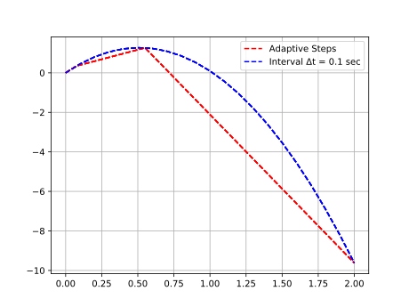
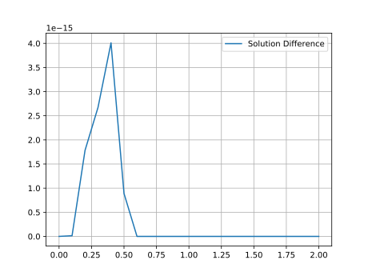
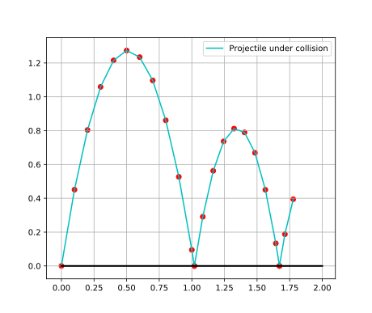

# A Quick Intro to Julia - METU ATLAS GROUP

Date: 2nd  May 2019  
Motivational video from JuliaCon 2018 attendees  


<iframe width="1280" height="720" src="https://www.youtube.com/embed/baR02tlea5Y" frameborder="0" allow="accelerometer; autoplay; encrypted-media; gyroscope; picture-in-picture" allowfullscreen>
</iframe>


## Comments

```julia
julia> # Comment

julia> #=
             COMMENT SECTION
          This is a multi-line comment
       =#

```

## Characters and Strings

Characters use `' '` single quotes and can be any Unicode Character. Special
characters are usually available with `\{latex-like-name}`+TAB. For example,
α can be written in julia REPL (Read-Evaluate-Print-Loop) as typing \alpha
and pressing TAB key.

```julia
julia> 'C'
'C': ASCII/Unicode U+0043 (category Lu: Letter, uppercase)

julia> '😃'
'😃': Unicode U+01f603 (category So: Symbol, other)

```

There are two ways to get a string literal: double quotes, triple double quotes.

```julia
julia> "String "
"String "

julia> """
       Multiline Strings
       Can be useful
       ẋ = Ax + Bu
       y = Cx + Du
       """
"Multiline Strings\nCan be useful\nẋ = Ax + Bu\ny = Cx + Du\n"

```

## Numbers

Julia has some abstract and some concrete number types, a portion of the latter
can be constructed by literals. The concrete numbers are mirrored as common
CPU numbers such as 8,16,32,64 bit integers and 32 and 64 bit float numbers when
available to the machine. There are also big and 128-bit integer and float
numbers as well as 16 bit floats though they are not mapped directly machine
numbers. Operations on this values are bound to what corresponding CPU
instruction does; therefore, integers can overflow and underflow, floats may not
be exact.

```julia
julia> 0x1 #8-bit unsigned integer
0x01

julia> 1 #64-bit or 32-bit signed integer depending on system integer size
1

julia> 1.0 #64-bit IEEE floating number
1.0

julia> big"1" # A big integer
1

julia> big"1.0" # A big float
1.0

julia> 1.0f0 # 32-bit IEEE floating number
1.0f0
```

## Arrays

Arrays are containers for multiple objects stacked in multiple dimensions. Type
signature is `Array{T, N}` where `T` refers to a type or collection of types and
determining containable objects and `N` is the dimension. `[...]` syntax
generates Arrays. Within brackets, while comma (`,`) separates objects without
concatenation, semicolon (`;`) causes concatenation.

```julia
julia> [1, 2, 3] # An array with dimension 1 and element type Int64
3-element Array{Int64,1}:
 1
 2
 3

julia> [1; 2; 3] # An array with dimension 1 and element type Int64
3-element Array{Int64,1}:
 1
 2
 3

julia> [[1; 2; 3], [1; 2; 3]] # An array with dimension 1 and element type Array{Int64, 1}
2-element Array{Array{Int64,1},1}:
 [1, 2, 3]
 [1, 2, 3]

julia> [[1; 2; 3]; [1; 2; 3]]  # An array with dimension 1 and element type Int64
6-element Array{Int64,1}:
 1
 2
 3
 1
 2
 3

julia> [1 2 3
       4 5 6] # An array with dimension 2 and element type Int64
2×3 Array{Int64,2}:
 1  2  3
 4  5  6

```

We can also initialize arrays with their constructors without setting element
values.

```julia
julia> Array{Float64}(undef, 2) # A one-dimensional array with garbage elements
2-element Array{Float64,1}:
 6.90762826073923e-310
 6.90762826040564e-310

julia> Array{Float64}(undef, 2, 2) # A two-dimensional array with garbage elements
2×2 Array{Float64,2}:
 6.90763e-310  6.90763e-310
 6.90763e-310  8.48798e-314

julia> Array{UInt8}(undef, 2, 2, 2) # A three-dimensional array with garbage elements
2×2×2 Array{UInt8,3}:
[:, :, 1] =
 0x70  0x6e
 0x0c  0x81

[:, :, 2] =
 0x28  0x00
 0x7f  0x00

```

Functions such as `ones`, `zeros`, `rand` are useful to constructs Arrays
with desired element values.

```julia
julia> rand(Int, 3, 2) # A two-dimensional array with random Int64 elements
3×2 Array{Int64,2}:
 -4476424184950324271  5946311011698957211
  8545306388960892269  1129361699571286681
 -9005869575844081383  -527881233534858520

julia> rand(Int8, 3, 2) # A two-dimensional array with random Int8 elements
3×2 Array{Int8,2}:
  86   8
 120  38
  97  -8

julia> ones(3) # A one-dimensional array initialized with Float64 ones
3-element Array{Float64,1}:
 1.0
 1.0
 1.0

julia> ones(2, 5) # A two-dimensional array initialized with Float64 ones
2×5 Array{Float64,2}:
 1.0  1.0  1.0  1.0  1.0
 1.0  1.0  1.0  1.0  1.0

julia> zeros(Float32, 2, 5) # A two-dimensional array initialized with Float32 zeros
2×5 Array{Float32,2}:
 0.0  0.0  0.0  0.0  0.0
 0.0  0.0  0.0  0.0  0.0

```

## Control Flow Structures

There are 4 types of control flow syntax: if-clauses, for-loops, while-loops,
try-catch-finally.

### If-Clause

This syntax conditionally executes a chunk of code. If-clauses accepts only the
boolean values `true` and `false` as conditions.

```julia
julia> if sin(π/2) ≈ 1 # true
         println("sine of π/2 is approximately one")
       end
sine of π/2 is approximately one

julia> if 4 < 5 # true
           3 % 2 == 1 ? println("Odd") : println("Even")
       elseif 7 % 3 == 0 # else if 4 < 5 were not true
           println("Else if")
       else # else if  both conditions were not true
           println("Else")
       end
Odd

```

There is also ternary operator for conditional execution.

```julia
julia> sin(π/2) ≈ 1 ? println("sin of π/2 is one") : println("Dummy!")
sin of π/2 is one

```

### For-loops

Until an iterable object finishes, the loop body is executed with given iterant
in for-loop.

```julia
julia> for i = 1:10 # `i in 1:10` is the same
         if i < 5
           i % 2 == 1 ? println("Odd") : println("Even")
         elseif i % 3 == 0
           println("Jump to the beginning of the loop after iterating i = $i")
           continue # Jump to the next iteration of i
         elseif i % 4 == 0
           println("Jump out of the loop i = $i")
           break # End all iterations
         end
         println("End of the loop i = $i")
       end
Odd
End of the loop i = 1
Even
End of the loop i = 2
Odd
End of the loop i = 3
Even
End of the loop i = 4
End of the loop i = 5
Jump to the beginning of the loop after iterating i = 6
End of the loop i = 7
Jump out of the loop i = 8

```

### While-Loops

The loop body is executed until a condition is not met.

```julia
julia> i = 0 # initialize a variable
0

julia> while i <= 10   # check the condition
         global i += 1 # increment i
         if i < 5
           i % 2 == 1 ? println("Odd") : println("Even")
         elseif i % 3 == 0
           println("Jump to the begining of the loop after iterating i = $i")
           continue
         elseif i % 4 == 0
           println("Jump out of the loop i = $i")
           break
         end
         println("End of the loop i = $i")
       end
Odd
End of the loop i = 1
Even
End of the loop i = 2
Odd
End of the loop i = 3
Even
End of the loop i = 4
End of the loop i = 5
Jump to the begining of the loop after iterating i = 6
End of the loop i = 7
Jump out of the loop i = 8

```

### Try-catch-finally

`try` starts a block of code that is run until an exception occurs. If an error
does occur `catch` block gets the error and is executed till the end (Still
errors may occur and the execution then stops). Optional block `finally`, if exists,
is executed whether an error occurs.

```julia
julia> try
         z == 1
       catch e
         throw(e)
       finally
         global z = 2
       end
ERROR: UndefVarError: z not defined
Stacktrace:
 [1] top-level scope at REPL[97]:4

 julia> z = 1
 1

 julia> try
          z == 1
        catch e
          throw(e)
        finally
          global z = 2
        end
 true

 julia> z
 2

```

## Functions

There are two ways to declare a function: one-liner and multi-line.

```julia

julia> f(x, y) = y*x^y # Function declaration for one-liner
f (generic function with 1 method)

julia> f(1, 3) # Function call
3

julia> function helper(x, y) # Multi-line function definition
         s = x
         sold = zero(x)
         while sold !== s
           x /= y
           sold = s
           s += x
         end
         return s
       end
helper (generic function with 1 method)

julia> helper(1, 0)
Inf

julia> helper(0, 0)
0

julia> helper(1, 0.5)
Inf

julia> helper(1, 2)
2.0

```

There is also anonymous functions.

```julia
julia> t = (x, y) -> y*x^y # The variable name t can be bound anything else later but f and helper not
#3 (generic function with 1 method)

julia> t(1, 3)
3

julia> t = 0
0

julia> t
0

julia> f = 0
ERROR: invalid redefinition of constant f
Stacktrace:
 [1] top-level scope at none:0

julia> t = function (x, y)
         s = x
         sold = zero(x)
         while sold !== s
           x /= y
           sold = s
           s += x
         end
         return s
       end
 #5 (generic function with 1 method)

 julia> t(1, 2)
 2.0

```

## Variables and Their Scope

A variable can be attached to a type or may be free. In `Functions` chapter,
it seen that names attached to functions cannot be assigned to another value.

A top scope is a global scope in a module. In REPL, everything is get to defined
in `Main` module.

```julia
julia> a = 2 # a globally bound to 2 in module Main
2

julia> Main.a
2

julia> typeof(a)
Int64

julia> a = 2.0 #It can change type
2.0

julia> typeof(a)
Float64

```

If a non- type changing variable is needed, `const` qualifier should precede the
assignment.

```julia
julia> const b = 0x1
0x01

julia> typeof(b)
UInt8

julia> b = 1 # cannot assign other than UInt8 values
ERROR: invalid redefinition of constant b
Stacktrace:
 [1] top-level scope at none:0

```

Globally defined variables are available for reading in every point of the
module they are defined. However, to disambiguate the usage of global variables
from local variables in an inner block of the module, `global` qualifier has to
be used.

```julia
julia> x = 1
1

julia> let
           println("x reads as $x")
       end
x reads as 1

julia> let
           x += 1
           println("x reads as $x")
       end
ERROR: UndefVarError: x not defined
Stacktrace:
 [1] top-level scope at none:2

julia> let
           global x += 1
           println("x reads as $x")
       end
x reads as 2

julia> let
           x = 3; x += 1; # Works because x is now local to this scope
           println("x reads as $x")
       end
x reads as 4

julia> x
2

```

This rule is also enforced in all top scope blocks including conditional blocks
of if-clause, for-loops, etc.

```julia
julia> x = 2
2
julia> for i = 1:10
         x += i
       end
ERROR: UndefVarError: x not defined
Stacktrace:
 [1] top-level scope at ./none:2

julia> for i = 1:10
         global x += i
       end

julia> x
57

```

## Broadcasting and Mapping

Operators and functions can be applied on arrays or array-like objects
element-wise. For example, for scalar `+` operator, `.+` is the element-wise
counterpart and for scalar `sin` function, `sin.` is.  


```julia
julia> 1+1
2

julia> (1:10) .+ 2
3:12

julia> (1:10) .+ (1:10)
2:2:20

julia> (1:3) .+ [1, 5]'
3×2 Array{Int64,2}:
 2  6
 3  7
 4  8

 julia> sin(π/2)
1.0

julia> a = range(0, π, step=π/16)
0.0:0.19634954084936207:3.141592653589793

julia> sin.(a)
17-element Array{Float64,1}:
 0.0                   
 0.19509032201612825   
 0.3826834323650898    
 0.5555702330196022    
 0.7071067811865475    
 0.8314696123025452    
 ⋮                     
 0.7071067811865476    
 0.5555702330196022    
 0.3826834323650899    
 0.1950903220161286    
 1.2246467991473532e-16

```

## Modules and Packages

There are some standard libraries bundled with julia. `LinearAlgebra`,
`SparseArrrays`, and `Statistics` are examples of standard libraries. To put
them in use, they should be imported by `import` or `using` syntax.

```julia
julia> dot(ones(5), ones(5)) # dot product is not available now
ERROR: UndefVarError: dot not defined
Stacktrace:
 [1] top-level scope at none:0

julia> import LinearAlgebra # import LinearAlgebra Module

julia> dot(ones(5), ones(5)) # Still dot product is not available
ERROR: UndefVarError: dot not defined
Stacktrace:
 [1] top-level scope at none:0

julia> LinearAlgebra.dot(ones(5), ones(5)) # But can call with LinearAlgebra namespace
5.0

julia> using LinearAlgebra # Now the exported names from LinearAlgebra is available

julia> dot(ones(5), ones(5))
5.0

```

Other than standard libraries, The Julia Language can pull packages from GitHub
repositories. For later usage, `DifferentialEquations.jl` and `PyPlot.jl`
packages are shown to how to be installed.

```julia
julia>] #Press right bracket in REPL

(v1.1) pkg> #Prompts this

(v1.1) pkg> add DifferentialEquations PyPlot
 Resolving package versions...
 # Bunch of install directives

(v1.1) pkg> # Press Backspace button to turn back to REPL

julia> # Prompts this

julia> using DifferentialEquations, PyPlot
[ Info:  # Some Pre-compilation Statements
]

```

## Ordinary Differential Equations

Differential equations show rate of change of states. For example, projectile
motion can be modeled as  
ẋ = Vₓ  
ẏ = v  
v̇ = -g  

```julia
julia> """A description of the function \n
       ẋ = Vₓ \n  
       ẏ = v \n
       v̇ = -g \n
       """
       projectile_motion(u, p, t) = [p[1], u[3], p[2]]
projectile_motion
```

To create a problem `ODEProblem` function is used.

```julia
julia> u0 = [0.0, 0.0, 5.0]
3-element Array{Float64,1}:
 0.0
 0.0
 5.0

julia> params = [1, -9.81]
2-element Array{Float64,1}:
  1.0
 -9.81

julia> tspan = (0.0, 2.0)
(0.0, 2.0)

julia> prob = ODEProblem(projectile_motion, u0, tspan, params)
ODEProblem with uType Array{Int64,1} and tType Int64. In-place: false
timespan: (0, 2)
u0: [0, 0, 5]

```

To solve the problem, `solve` function is used. The function takes a problem,
a method for solving the problem, and other parameters for this method.

```julia
julia> sol = solve(prob, Tsit5(), abstol=1e-8, reltol=1e-8)
retcode: Success
Interpolation: specialized 4th order "free" interpolation
t: 5-element Array{Float64,1}:
 0.0                  
 0.0070693311194078125
 0.07490849421525578  
 0.5503901400837413   
 2.0                  
u: 5-element Array{Array{Float64,1},1}:
 [0.0, 0.0, 5.0]                 
 [0.00706933, 0.0351015, 4.93065]
 [0.0749085, 0.347019, 4.26515]  
 [0.55039, 1.26608, -0.399327]   
 [2.0, -9.62, -14.62]

```

 The solver uses adaptive steps and saves the results at time instances.
 Let's change saving times now.

```julia
julia> sol1 = solve(prob, Tsit5(), abstol=1e-8, reltol=1e-8, saveat=0.1)
retcode: Success
Interpolation: 1st order linear
t: 21-element Array{Float64,1}:
 0.0
 0.1
 0.2
 0.3
 0.4
 0.5
 ⋮  
 1.6
 1.7
 1.8
 1.9
 2.0
u: 21-element Array{Array{Float64,1},1}:
 [0.0, 0.0, 5.0]         
 [0.1, 0.45095, 4.019]   
 [0.2, 0.8038, 3.038]    
 [0.3, 1.05855, 2.057]   
 [0.4, 1.2152, 1.076]    
 [0.5, 1.27375, 0.095]   
 ⋮                       
 [1.6, -4.5568, -10.696]
 [1.7, -5.67545, -11.677]
 [1.8, -6.8922, -12.658]
 [1.9, -8.20705, -13.639]
 [2.0, -9.62, -14.62]  

```

Let's see how they evolves

```julia
julia> plot(sol[1, :], sol[2, :], "r--", sol1[1, :], sol1[2, :], "b--")
2-element Array{PyCall.PyObject,1}:
 PyObject <matplotlib.lines.Line2D object at 0x7f7d163290f0>
 PyObject <matplotlib.lines.Line2D object at 0x7f7d1629f358>

julia> legend(("Adaptive Steps", L"Interval $\Delta$t = 0.1 sec"),loc=1)
PyObject <matplotlib.legend.Legend object at 0x7f7d1634ce80>

julia> grid(true)

```



Let's see difference between them.

```julia
julia> plot(sol1.t, norm.(sol.(0:0.1:2) .- sol1.(0:0.1:2)))
1-element Array{PyCall.PyObject,1}:
 PyObject <matplotlib.lines.Line2D object at 0x7f7d9f4c2828>

julia> legend(("Solution Difference",), loc=1)
PyObject <matplotlib.legend.Legend object at 0x7f7d9fd62a58>

julia> grid(true)

```



Let's add ball collision

```julia
julia> condition(u, t, integ) = u[2]
condition (generic function with 1 method)

julia> function affect!(integ)
           integ.u[2] =  0
           integ.u[3] = -0.8integ.u[3]
           integ.p[1] =  0.8integ.p[1]
       end
affect! (generic function with 1 method)

julia> cb = ContinuousCallback(condition, affect!, abstol=1e-14, interp_points=100);

julia> sol2 = solve(prob, Tsit5(), abstol=1e-8, reltol=1e-8, saveat=0.1, callback=cb)
retcode: Success
Interpolation: 1st order linear
t: 25-element Array{Float64,1}:
 0.0              
 0.1              
 0.2              
 0.3              
 0.4              
 0.5              
 ⋮                
 1.8              
 1.834862385321088
 1.834862385321088
 1.9              
 2.0              
u: 25-element Array{Array{Float64,1},1}:
 [0.0, 0.0, 5.0]              
 [0.1, 0.45095, 4.019]        
 [0.2, 0.8038, 3.038]         
 [0.3, 1.05855, 2.057]        
 [0.4, 1.2152, 1.076]         
 [0.5, 1.27375, 0.095]        
 ⋮                            
 [1.64387, 0.133488, -3.658]  
 [1.67176, -1.01251e-14, -4.0]
 [1.67176, 0.0, 3.2]          
 [1.71345, 0.187629, 2.561]   
 [1.77745, 0.394679, 1.58]   

julia> plot(sol2[1, :], sol2[2, :], "c-")
 1-element Array{PyCall.PyObject,1}:
  PyObject <matplotlib.lines.Line2D object at 0x7f9d1689a160>

julia> plot(sol2.t, zeros(size(sol2.t)), "k", linewidth=2.0)
 1-element Array{PyCall.PyObject,1}:
  PyObject <matplotlib.lines.Line2D object at 0x7f9d1a0a9438>

julia> scatter(sol2[1, :], sol2[2, :], color="r")
 PyObject <matplotlib.collections.PathCollection object at 0x7f9d17f7fe48>

julia> legend(("Projectile under collision", ), loc=1)
 PyObject <matplotlib.legend.Legend object at 0x7f9d19fee6a0>

julia> grid(true)

```



Lutfullah Tomak, 2019
